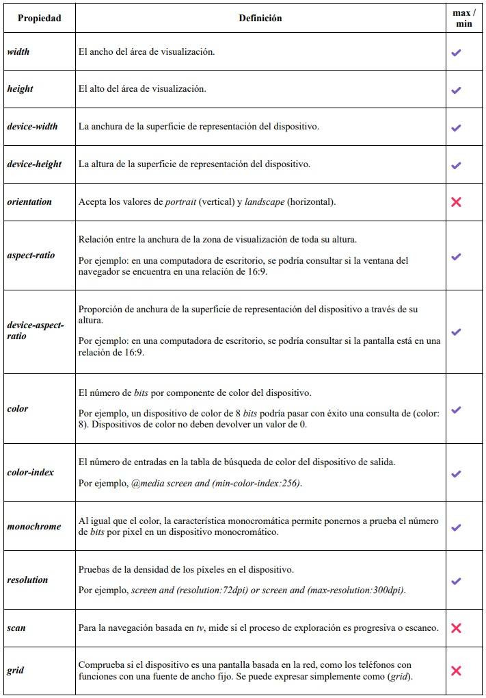
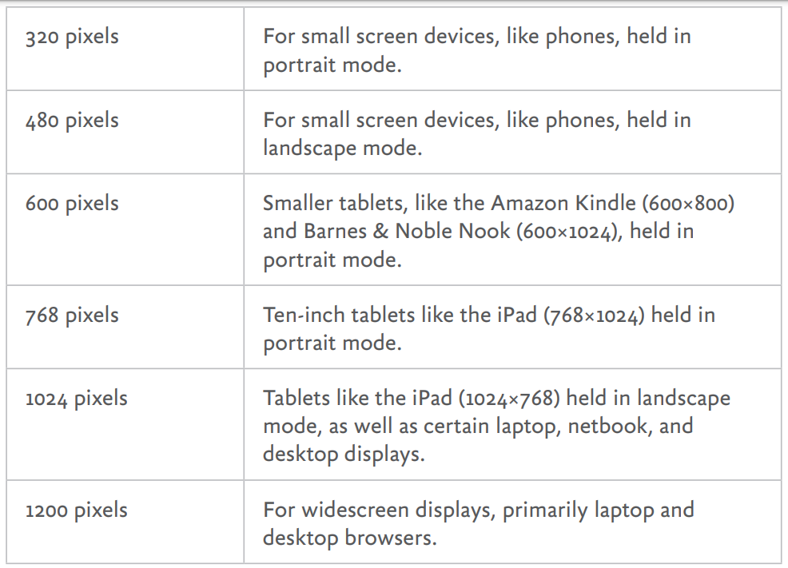
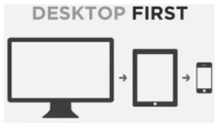
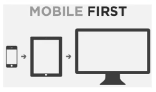

# Responsive y Arquitectura

## 3 Principios del Responsive Design

1. Grid Flexibles
2. Imágenes Flexibles
3. Media Queries

**No sólo** es pensar en **adaptar** el **contenido** al tamaño de la pantalla. Tambien es considerar:

-   Conexion de Red
-   Hardware y Software de los dispositivos
-   Interacciones
-   Accesibilidad web

### Estrategias de Diseño Multidispositivos

-   Responsive Design
-   Adaptive Design
-   Responsive + Server Side (RESS)
-   Responsible Responsive Design
-   Fluid Design

## Contenedor Flexible

Todos los elementos de nuestra interfaz tienen que ser flexibles y responsivos. Pensar más en proporciones (porcentajes) que pixeles.

-   Caja flexible: Las propiedades de ancho y alto se definen con unidades relativas (%, vw, vh)

```CSS
[class^="box"] {
    margin: 3rem auto;
    background-color: orangered;
}

/* 1px = 1/96 pulgada */
.box {
    width: 300px;
    height: 300px;
}

/* Caja flexible - las propiedades de ancho y alto se definen
   con unidades relativas (%, rem) */
.box-flexible {
    width: 50%;
    height: 20vh;
}
```

### Propiedades max-width min-width max-height y min-height

```CSS
.box-flexible-2 {

    /* MAX-WIDTH */
    max-width: 960px;

    /* MIN-WIDTH */
    min-width: 280px;

    /* MAX-HEIGHT */
    /* Una caja crece en altura dependiendo de su
       contenido pero el contenido se desborda
       cuando llega a su maxima altura */
    max-height: 480px;

    /* MIN-HEIGHT */
    min-height: 280px;
}
```

### Tamaños fijos VS Tamaños máximos y mínimos

Al establecer valores de fijos (px) en width y hight, los valores
max-width, min-width, max-height y min-height seran ignorados.

Cuando tienes contenedores flexibles con max y min de anchura y altura,
no se generan problemas, pero si y ademas defines width y height con unidades absolutas (px) la fluides se pierde por que tienen más herarquia, cuando las defines con unidades relativas (%, vw) si obedesen eso maximos y minimos establecidos.

```CSS
.box-flexible-3 {
    max-width: 960px;
    min-width: 280px;

    max-height: 480px;
    min-height: 280px;

    width: 300px;
    height: 300px;
}

.box-flexible-4 {
    max-width: 960px;
    min-width: 280px;
    max-height: 480px;
    min-height: 280px;

    width: 50%;
    height: 20vh;
}
```

## Multimedia Flexible

Un elemento **_multimedia es todo aquello que no es texto_**, las siguientes etiquetas son ejemplos de multimedia:

|        |         |
| ------ | ------- |
| img    | picture |
| audio  | object  |
| video  | embed   |
| iframe | map     |
| canvas | area    |
| svg    |         |

En el **Responsive Design** la **_multimedia_** debe ser flexible y adaptarse al tamaño de su contenedor, lo podemos lograr con las siguiente regla CSS:

```CSS
img, audio, video, iframe,
canvas, svg, picture {
    max-width:100%;
    height: auto;
}
```

### Imágenes Responsivas

Simplemente adaptamos la imagen al tamaño de su contenedor.

```CSS
img,
video,
iframe {
    max-width: 100%;
    height: auto;
}

.responsive-media {
    position: relative;
    max-width: 100%;
    height: 0;

    /*
     Formato Widescreen - 16:9
     16 w ---> 100%
     9 h  ---> 56.25%
    */
    padding-bottom: 56.25%;
}

.responsive-media > * {
    position: absolute;
    width: 100%;
    height: 100%;
}

.aspect-ratio-16-9 {
    background-color: rebeccapurple;
    aspect-ratio: 16 / 9;
}

.aspect-ratio-1-1 {
    aspect-ratio: 1 / 1;
}
```

#### Atributo srcset y sizes

El propósito de estos atributos, es mejorar el rendimiento de carga, al colocar la misma imagen pero en diferentes tamaños y pesos, dependiendo del tamaño o la resolución de la pantalla.

-   1x - Aspect Radio 100% del tamaño original
-   1.5x - Aspect Radio 150% del tamaño original
-   2x - Aspect Radio 200% del tamaño original

```HTML

```

-   1ra imagen hasta los 600px (width).
-   2ra imagen desde 900px (width) en adelante.
-   3ra imagen a partir de los 1200px (width).

```HTML

```

```HTML

```

#### Etiqueta picture

El objetivo de esta etiqueta, no es sólo mostrar diferentes tamaños de la misma imagen, sino también mostrar imágenes diferentes. Por ejemplo, recortar una imagen de forma diferente según el tamaño de la pantalla y las diferencias en el diseño. Esto se conoce como "dirección de arte".

```HTML
<picture>
    <source srcset="img/kitten-large.png" media="(min-width: 1024px)">
    <source srcset="img/kitten-medium.png" media="(min-width: 600px)">
    
</picture>

<picture>
    <source srcset="img/butterfly.webp" type="image/webp">
    
</picture>
```

### Videos Responsivos

```HTML
<video src="assets/kenai.mp4" controls muted></video>

<div class="responsive-media">
    <video src="assets/kenai.mp4" controls muted></video>
</div>

<video class="aspect-ratio-16-9" src="assets/kenai.mp4"></video>
<div class="aspect-ratio-16-9"></div>
```

### Iframes Responsivos

```HTML
<iframe width="560" height="315" src="https://www.youtube.com/embed/"
    frameborder="0" title="YouTube"
    allow="accelerometer; autoplay; clipboard-write;
    encrypted-media; gyroscope; picture-in-picture"
    allowfullscreen>
</iframe>

<div class="responsive-media">
    <iframe width="560" height="315"
        src="https://www.youtube.com/embed/"
        frameborder="0" title="YouTube"
        allow="accelerometer; autoplay; clipboard-write;
        encrypted-media; gyroscope; picture-in-picture"
        allowfullscreen>
    </iframe>
</div>

<iframe class="aspect-ratio-16-9" width="1024" height="720"
    src="https://www.youtube.com/embed/" frameborder="0"
    title="YouTube" allow="accelerometer; autoplay;
        clipboard-write; encrypted-media;
        gyroscope; picture-in-picture"
    allowfullscreen>
</iframe>
```

## Media Queries

### Media Queries versión 2.1

Desde la especificación de _CSS 2.1_, las hojas de estilo han tenido cierto grado de capacidad para el **reconocimiento de dispositivos** mediante el uso de tipos de medios. Por ejemplo:

```HTML
<!-- Pimera Vercion -->
<link rel="stylesheet" media="print" href="print.css">
<link rel="stylesheet" media="print" href="css/print.css">
```

```CSS
@page {
    size: A4;
}

body {
    font-size: 12pt;
    font-family: serif;
    background-color: #000;
    color: #fff;
}
```

### Media Queries versión 3

Con CSS3, la W3C perfeccionó y mejoró los tipos de medios con características multimedia y con la capacidad de preguntar dichas características a los medios.

Esto no sólo hace posible inspeccionar el contenido que se entrega al dispositivo, sino también las características físicas reales del dispositivo.

El uso de _media queries_ permite pedir fácilmente al navegador sus características, tales como anchura, altura, relación de aspecto, orientación, entre otras.

La sintaxis es la siguente:

```CSS
@media screen and (max-width:480px) and (orientation:portrait) {
  /*
  Código CSS que se aplicará cuando se cumpla la media queries
  */
}
```

#### Propiedades que soportan **_Media Queries_**



#### Media Queries Para Impresión

```CSS
@media print {

    @page {
        size: A5 landscape;
    }

    body {
        font-size: 10pt;
        font-family: sans-serif;
        background-color: #000;
        color: greenyellow;
    }
}
```

[CSS para Impresión](https://www.smashingmagazine.com/2015/01/designing-for-print-with-css)

#### Media Queries para Modo Oscuro/Claro

```CSS
@media screen and (prefers-color-scheme: dark) {
    html {
        background-color: #111;
        color: whitesmoke;
    }
}

@media screen and (prefers-color-scheme: light) {
    html {
        background-color: #fff;
        color: dark;
    }
}

@media screen and (prefers-color-scheme: no-preference) {
    html {
        background-color: #fff;
        color: dark;
    }
}

@media screen and (prefers-color-scheme: dark) {
    html {
        background-color: white;
        color: black;
    }
}
```

#### Media Queries min-width max-width

```CSS
/* En Mobile First se usa min-width que significa lo minimo, del
   valor que des hacia arriba */
@media screen and (min-width: 480px) {
    html {
        background-color: lightpink;
    }
}

/* En Desktop First se usa max-width que significa lo maximo, del
   valor que des hacia abajo */
@media screen and (max-width: 1024px) {
    html {
        background-color: lightgreen;
    }
}

@media screen and (min-width: 1200px) {
    html {
        background-color: white;
    }
}
```

#### Otros

```CSS
@media screen and (prefers-reduced-motion: reduce) {
    html {
        scroll-behavior: auto;
        scroll-behavior: smooth;
    }
}

@media screen and (prefers-reduced-motion: no-preference) {

    html {
        scroll-behavior: auto;
        scroll-behavior: smooth;
    }
}
```

## Breakpoints

Es la medida o punto de iterrupción en la cual se decide aplicar distintos estilos CSS a la interfaz. Ethan Marcotte en su libro Responsive Design páginas 113-114 nos propone la siguiente lista de puntos de interrupción según la resolución del dispositivo:



-   **320px**: Para dispositivos con pantallas pequeñas, como los teléfonos en modo vertical.

-   **480px**: Para dispositivos con pantallas pequeñas, como los teléfonos, en modo horizontal.

-   **600px**: Tabletas pequeñas, como el Amazon Kindle (600×800) y Barnes & Noble Nook (600×1024), en modo vertical.

-   **768px**: Tabletas de diez pulgadas como el iPad (768×1024), en modo vertical.

-   **1024px**: Tabletas como el iPad (1024×768), en modo horizontal, así como algunas pantallas de ordenador portátil, netbook, y de escritorio.

-   **1200px**: Para pantallas panorámicas, principalmente portátiles y de escritorio.

Con la tabla que _Ethan Marcotte_ nos propone prácticamente están cubiertos teléfonos inteligentes, tabletas, phablets, laptops, netbooks, computadoras de escritorio y pantallas, tanto en modo vertical como horizontal, por lo que con estos 6 puntos de interrupción sólo tendríamos que validar un solo atributo en las media queries: el **ancho**.

De cualquier forma en el sitio _screensiz.es_, se puede estar revisando constantemente las características físicas con las que se fabrican los dispositivos.

**¡Importante! Convierte tus Breakpoints a EMs**

**¿Por qué?**

Aunque los pixeles se consideran una unidad de medida absoluta, en realidad son unidades relativas a la resolución de pantalla del dispositivo que lo visualiza, si dicho dispositivo tiene una densidad mayor a la normal, entonces la proporción de los pixeles cambiará, por ello es importante que los breakpoints de las media queries se conviertan a ems que si son unidades relativas y proporcionales.

**Más información**

[The EMs have it: Proportional Media Queries.](http://blog.cloudfour.com/the-ems-have-it-proportional-media-queries-ftw/)

[Why Ems?.](https://css-tricks.com/why-ems/)

[CSS px is an Angular Measurement.](http://127.0.0.1:5500/Responsive-ArquitecturaCSS/index.html#breakpoints)

**Entonces**

> _Objetivo en pixeles_ **/** _Contexto en pixeles_ = **Resultado en Ems**
>
> 320px / 16px = 20em
>
> 480px / 16px = 30em
>
> 600px / 16px = 37.5em
>
> 768px / 16px = 48em
>
> 1024px / 16px = 64em
>
> 1200px / 16px = 75em

## Viewport

El _viewport_ fue introducido por _Apple_ en _Safari_ móvil, para ayudar a mejorar la presentación de los sitios en dispositivos como el _iPhone_, _iPod_ _Touch_ o _iPad_; posteriormente se volvió un estándar en todos los navegadores.

La etiqueta _viewport_ es el área visible de nuestro navegador y nos permite definir el ancho, alto y escala del área usada por el navegador para mostrar el contenido.

Si no agregamos esta meta etiqueta a nuestros documentos _HTML_ tendremos problemas de visualización.

El _viewport_ tiene 6 atributos importantes:

1. **width**: Define el ancho visible, suele usarse la constante device-width para que se adapte al ancho del dispositivo.

2. **height**: Define el alto visible, suele usarse la constante device-height para que se adapte al alto del dispositivo.

3. **initial-scale**: Define la escala inicial a la que deberá visualizarse el contenido, siendo 1 el 100%.

4. **minimum-scale**: Define la escala mínima a la que se podrá hacer zoom al contenido, por ejemplo si se configura .5 significa que se podrá hacer un zoom de hasta el 50%.

5. **maximum-scale**: Define la escala máxima a la que se podrá hacer zoom al contenido, por ejemplo si se configura 3 significa que se podrá hacer un zoom de hasta el 300%.

6. **user-scalable**: Define si el usuario puede escalar o no el contenido, sus valores son yes por defecto y no para bloquear esta propiedad.

De los 6 atributos mencionados, hay 2 que son muy importantes definir el **ancho** y la **escala inicial**, para que el contenido se adapte al tamaño del dispositivo.

Adicionalmente se recomienda que no se especifique la máxima escala, ni bloquear la capacidad de escalar el contenido, ya que independientemente de que el documento se diseñe con _responsive_, algunos usuarios con capacidades visuales diferentes, podrían tener problemas al ver el contenido y desearían aumentar el tamaño del contenido, si definimos una escala máxima o bloqueamos la capacidad de escalar el contenido produciremos en estos usuarios una mala y frustrante experiencia de usuario.

La propiedad del alto es opcional definirla, se utilizara cuando necesitemos condicionar el alto del contenido.

Por lo anterior la etiqueta meta _viewport_ tendría que definirse de la siguiente manera:

```HTML
<meta name="viewport" content="width=device-width,initial-scale=1.0">
```

## Responsive Grid Artesanal

```HTML
<section class="row">
    <article class="col-12 col-sm-6 col-md-4 col-lg-3 col-xl-2">Elemento 1</article>
    <article class="col-12 col-sm-6 col-md-4 col-lg-3 col-xl-2">Elemento 2</article>
    <article class="col-12 col-sm-6 col-md-4 col-lg-3 col-xl-2">Elemento 3</article>
    <article class="col-12 col-sm-6 col-md-4 col-lg-3 col-xl-2">Elemento 4</article>
    <article class="col-12 col-sm-6 col-md-4 col-lg-3 col-xl-2">Elemento 5</article>
    <article class="col-12 col-sm-6 col-md-4 col-lg-3 col-xl-2">Elemento 6</article>
    <article class="col-12 col-sm-6 col-md-4 col-lg-3 col-xl-2">Elemento 7</article>
    <article class="col-12 col-sm-6 col-md-4 col-lg-3 col-xl-2">Elemento 8</article>
    <article class="col-12 col-sm-6 col-md-4 col-lg-3 col-xl-2">Elemento 9</article>
    <article class="col-12 col-sm-6 col-md-4 col-lg-3 col-xl-2">Elemento 10</article>
    <article class="col-12 col-sm-6 col-md-4 col-lg-3 col-xl-2">Elemento 11</article>
    <article class="col-12 col-sm-6 col-md-4 col-lg-3 col-xl-2">Elemento 12</article>
    <article class="col-12 col-sm-6 col-md-4 col-lg-3 col-xl-2">Elemento 13</article>
    <article class="col-12 col-sm-6 col-md-4 col-lg-3 col-xl-2">Elemento 14</article>
    <article class="col-12 col-sm-6 col-md-4 col-lg-3 col-xl-2">Elemento 15</article>
    <article class="col-12 col-sm-6 col-md-4 col-lg-3 col-xl-2">Elemento 16</article>
    <article class="col-12 col-sm-6 col-md-4 col-lg-3 col-xl-2">Elemento 17</article>
    <article class="col-12 col-sm-6 col-md-4 col-lg-3 col-xl-2">Elemento 18</article>
    <article class="col-12 col-sm-6 col-md-4 col-lg-3 col-xl-2">Elemento 19</article>
</section>
```

```CSS
/*
    12 / 1 = 12
    12 / 2 = 6
    12 / 3 = 4
    12 / 4 = 3
    12 / 6 = 2
    12 / 12 = 1

    5 + 7 = 12
    2 + 5 + 5 = 12
    4 + 2 + 3 + 3 = 12

    12 ---> 100%
    ?col ---> ??%

    Grid System Artesanal con Flexbox a 12 columnas

    Tamaños (Mediaqueries)

    xs   -   extrasmall   -  0px             479px     -  480res
    sm   -   small        -  480px (30em)    767px     -  800res
    md   -   medium       -  768px (48em)    991px     -  1024res
    lg   -   large        -  992px (62em)    1199px    -  1280res
    xl   -   extralarge   - +1200px (75em)             -  >1281res

*/

html {
    box-sizing: border-box;
    font-size: 16px;
}

*,
*::after,
*::before {
    box-sizing: inherit;
}

.row {
    display: flex;
    flex-wrap: wrap;
}

.row > [class^="col"] {
    border: thin solid gray;
    padding: .5rem;
}

.col-1 {
    width: 8.3333333333333333333333333333333%;
}
.col-2 {
    width: 16.666666666666666666666666666667%;
}
.col-3 {
    width: 25%;
}
.col-4 {
    width: 33.333333333333333333333333333333%;
}
.col-5 {
    width: 41.666666666666666666666666666667%;
}
.col-6 {
    width: 50%;
}
.col-7 {
    width: 58.333333333333333333333333333333%;
}
.col-8 {
    width: 66.666666666666666666666666666667%;
}
.col-9 {
    width: 75%;
}
.col-10 {
    width: 83.333333333333333333333333333333%;
}
.col-11 {
    width: 91.666666666666666666666666666667%;
}
.col-12 {
    width: 100%;
}

@media screen and (min-width: 30em) {
    .col-sm-1 {
        width: 8.3333333333333333333333333333333%;
    }
    .col-sm-2 {
        width: 16.666666666666666666666666666667%;
    }
    .col-sm-3 {
        width: 25%;
    }
    .col-sm-4 {
        width: 33.333333333333333333333333333333%;
    }
    .col-sm-5 {
        width: 41.666666666666666666666666666667%;
    }
    .col-sm-6 {
        width: 50%;
    }
    .col-sm-7 {
        width: 58.333333333333333333333333333333%;
    }
    .col-sm-8 {
        width: 66.666666666666666666666666666667%;
    }
    .col-sm-9 {
        width: 75%;
    }
    .col-sm-10 {
        width: 83.333333333333333333333333333333%;
    }
    .col-sm-11 {
        width: 91.666666666666666666666666666667%;
    }
    .col-sm-12 {
        width: 100%;
    }
}

@media screen and (min-width: 48em) {
    .col-md-1 {
        width: 8.3333333333333333333333333333333%;
    }
    .col-md-2 {
        width: 16.666666666666666666666666666667%;
    }
    .col-md-3 {
        width: 25%;
    }
    .col-md-4 {
        width: 33.333333333333333333333333333333%;
    }
    .col-md-5 {
        width: 41.666666666666666666666666666667%;
    }
    .col-md-6 {
        width: 50%;
    }
    .col-md-7 {
        width: 58.333333333333333333333333333333%;
    }
    .col-md-8 {
        width: 66.666666666666666666666666666667%;
    }
    .col-md-9 {
        width: 75%;
    }
    .col-md-10 {
        width: 83.333333333333333333333333333333%;
    }
    .col-md-11 {
        width: 91.666666666666666666666666666667%;
    }
    .col-md-12 {
        width: 100%;
    }
}

@media screen and (min-width: 62em) {
    .col-lg-1 {
        width: 8.3333333333333333333333333333333%;
    }
    .col-lg-2 {
        width: 16.666666666666666666666666666667%;
    }
    .col-lg-3 {
        width: 25%;
    }
    .col-lg-4 {
        width: 33.333333333333333333333333333333%;
    }
    .col-lg-5 {
        width: 41.666666666666666666666666666667%;
    }
    .col-lg-6 {
        width: 50%;
    }
    .col-lg-7 {
        width: 58.333333333333333333333333333333%;
    }
    .col-lg-8 {
        width: 66.666666666666666666666666666667%;
    }
    .col-lg-9 {
        width: 75%;
    }
    .col-lg-10 {
        width: 83.333333333333333333333333333333%;
    }
    .col-lg-11 {
        width: 91.666666666666666666666666666667%;
    }
    .col-lg-12 {
        width: 100%;
    }
}

@media screen and (min-width: 75em) {
    .col-xl-1 {
        width: 8.3333333333333333333333333333333%;
    }
    .col-xl-2 {
        width: 16.666666666666666666666666666667%;
    }
    .col-xl-3 {
        width: 25%;
    }
    .col-xl-4 {
        width: 33.333333333333333333333333333333%;
    }
    .col-xl-5 {
        width: 41.666666666666666666666666666667%;
    }
    .col-xl-6 {
        width: 50%;
    }
    .col-xl-7 {
        width: 58.333333333333333333333333333333%;
    }
    .col-xl-8 {
        width: 66.666666666666666666666666666667%;
    }
    .col-xl-9 {
        width: 75%;
    }
    .col-xl-10 {
        width: 83.333333333333333333333333333333%;
    }
    .col-xl-11 {
        width: 91.666666666666666666666666666667%;
    }
    .col-xl-12 {
        width: 100%;
    }
}
```

## Feature Queries

Las Feature Queries son reglas CSS que le preguntan al navegador si soportan o no, una determinada propiedad o valor.

```CSS
@supports (display: grid) {
  /*
      Código CSS que se aplicará cuando se cumpla la feature queries
  */
}
```

```CSS
@supports (grid-template-columns: subgrid) {
    html {
        background-color: black;
        color: greenyellow;
    }
}

@supports not (grid-template-columns: subgrid) {
    html {
        background-color: darkolivegreen;
        color: white;
    }
}

@supports (display: grid) and (grid-template-columns: subgrid) {
    html {
        background-color: darkslateblue;
        color: lightseagreen;
    }
}

@supports (display: grid) or (grid-template-columns: subgrid) {
    html {
        background-color: white;
        color: black;
    }
}
```

## Container Queries

Los Container Queries nos permiten hacer componentes responsivos de interfaz de usuario, que no dependan del tamaño de la pantalla y las media queries para cambiar o adaptar el diseño de su contenido. Sino que dependan de sus propias necesidades de visualización.

**Más información**

-   [_CSS Container Queries MDN_](https://developer.mozilla.org/en-US/docs/Web/CSS/CSS_Container_Queries)
-   [_The new responsive_](https://web.dev/new-responsive/)
-   [_Say Hello To CSS Container Queries_](https://ishadeed.com/article/say-hello-to-css-container-queries/)

**Sintaxis**

```CSS
.card {
    /* contain: layout inline-size style; */
    container-type: inline-size;
}

@container (min-width: 600px) {
    .card-container {
        display: flex;
    }
}
```

**Ejemplo**

```HTML
<aside>
    <article class="card">
        <div class="card-container">
            
            <aside class="card-content">
                <h4 class="card-title">Card Title</h4>
                <p class="card-description">Lorem ipsum dolor sit amet consectetur adipisicing elit. Maiores sit ad, placeat sed maxime praesentium velit dolor. Iusto ex blanditiis dicta, accusamus expedita beatae quasi odit quibusdam, eum, consectetur magni?</p>
            </aside>
        </div>
    </article>
</aside>
```

```CSS
.card {
    border: thin solid black;
    margin-left: auto;
    margin-right: auto;
    max-width: 800px;

    /* ACTIVANDO CONTAINER QUERIES */
    /* contain: layout inline-size style;(removido de la especificacion) */
    container-type: inline-size;
    container-name: mycard ;
}

.card-image {
    max-width: 100%;
    height: auto;
    object-fit: cover;
    object-position: 0 50%;
}

.card-content {
    padding: 1rem;
}

/* chrome://flags */
/* brave://flags */

@container mycard (min-width: 600px) {
    .card-container {
        display: flex;
    }

    .card-container > * {
        width: 50%;
        flex-basis: 50%;
    }
}
```

## SEO

**Search Engine Optimization**

**_Mobilegeddon_**

Es la actualización al algoritmo de _Google_, que está activo desde el **21 de abril de 2015**.

Teniendo en cuenta el auge imparable de los dispositivos móviles y el impacto que éstos están teniendo en las costumbres de uso de la web, _Google_ hizo un comunicado a través de su [blog oficial](http://googlewebmastercentral.blogspot.com.es/2015/02/finding-more-mobile-friendly-search.html) comentando algunas de las novedades que trae la actualización de su algoritmo.

_Mobilegeddon_ pretende actuar sobre todas aquellas webs que no sean amigables con los dispositivos móviles, es decir que no se adapten de forma óptima a dichos dispositivos.

Dado que las estrategias de _Google_ se enfocan cada vez más hacia estos dispositivos, es normal que el buscador quiera asegurarse que las webs que indexa cumplen los mínimos de calidad para móviles.

_Mobilegeddon_, afecta:

-   Exclusivamente a las búsquedas realizadas desde dispositivos móviles.
-   La aplicación del algoritmo será en todos los idiomas y de forma global.
-   No se aplicará a sitios webs completos , sólo a las páginas que no cumplan los criterios.

**Buenas prácticas de SEO y Responsive, según Google**

-   [Guía de Google para sitios móviles](https://developers.google.com/webmasters/mobile-sites/?hl=es)
-   [SEO para móviles](https://developers.google.com/webmasters/mobile-sites/mobile-seo/?hl=es)
-   [Mobile Friendly Test](https://www.google.com/webmasters/tools/mobile-friendly/)
-   [PageSpeed Insights](https://developers.google.com/speed/pagespeed/insights/)

## Estrategias de Diseño Multidispositivos

### Responsive Design Desktop First VS Mobile First

Es el paradigma actual del diseño _web_. Son un conjunto de buenas prácticas a nivel de código CSS para adaptar el contenido del documento _HTML_ al tamaño de pantalla del dispositivo que lo visualice.

Tiene 3 principios:

1. Grids Flexibles
1. Imágenes Flexibles
1. Media Queries

Fue propuesto por [_Ethan Marcotte_](https://ethanmarcotte.com/) en 2010.

**Más información**

-   [Artículo Responsive Design](https://alistapart.com/article/responsive-web-design/)
-   [Libro Responsive Design](https://abookapart.com/products/responsive-web-design)

**Desktop First VS Mobile First**

Son las 2 estrategias que tiene el _Responsive Design_ para adaptar el contenido al tamaño de la pantalla, centrándose en los dispositivos con pantalla más pequeña (_Mobile First_) o a la inversa, centrándose en los dispositivos con pantalla más grande (_Desktop First_).

|                       Desktop First                        |                        Mobile First                        |
| :--------------------------------------------------------: | :--------------------------------------------------------: |
|                   (Graceful Degradation)                   |                 (Progressive Enhancement)                  |
| Las media queries se deben definir de la mayor a la menor. | Las media queries se deben definir de la menor a la mayor. |
| Se utiliza **_max-width_** para definir las mediaqueries.  | Se utiliza **_min-width_** para definir las mediaqueries.  |
|                                   |                                    |

### Adaptive Design

El _Adaptive Design_, trata de crear interfaces que se adapten a las capacidades y características de cada dispositivo (_Hardware_ y _Software_).

Utiliza programación _JavaScript_ para los cambios en la interfaz.

Además podría tener diferentes _fronts_ dependiendo de los dispositivos que soliciten el recurso, por ejemplo:

-   [Facebook Desktop](https://facebook.com/)
-   [Facebook Mobile](https://m.facebook.com/)

Fue propuesto por [_Aaron Gustafson_](https://www.aaron-gustafson.com/) en 2011.

**Más información**

-   [Artículo Adaptive Design](https://blog.easy-designs.net/archives/on-adaptive-vs-responsive-web-design/)
-   [Libro Adaptive Design](https://adaptivewebdesign.info/)
-   [Detección de Dispositivos con JS](https://www.youtube.com/watch?v=WHfyN411fd4&list=PLvq-jIkSeTUZ6QgYYO3MwG9EMqC-KoLXA)

### Responsive Design + Server Side Components (RESS)

El _Responsive Design + Server Side Components (RESS)_, trata de crear interfaces que se adapten a las capacidades y características de cada dispositivo (_Hardware_ y _Software_).

Pero a diferencia del _Adaptive Design_, la programación que usa esta del lado del servidor. Las interfaces se crean desde el backend, lo que permite usar la misma vista (ruta) para todos los dispositivos.

-   [Twitter](https://twitter.com/)
-   [YouTube](https://youtube.com/)

Fue propuesto por [Luke Wroblewski](https://www.lukew.com/) en 2011.

**Más información**

-   [Artículo original de Luke Wroblewski](https://www.lukew.com/ff/entry.asp?1392)
-   [Getting started with RESS](https://www.creativebloq.com/responsive-web-design/getting-started-ress-5122956)

### Responsible Responsive Design

Mientras que el _Responsive Design_ se basa en buenas prácticas de _CSS_ para adaptar el contenido del documento _HTML_ al tamaño de pantalla del dispositivo que lo visualice, el **_Responsible Responsive_** Design agrega buenas prácticas de programación _JS_ no sólo para adaptar el contenido a la pantalla, sino también para mejorar el rendimiento y la carga de la interfaz en el navegador _web_.

Fue propuesto por [Scott Jehl](https://scottjehl.com/) en 2014.

**Más información**

-   [Libro Responsible Responsive Design](https://abookapart.com/products/responsible-responsive-design)
-   [Responsive con JS](https://www.youtube.com/watch?v=6IwUl-4pAzc&list=PLvq-jIkSeTUZ6QgYYO3MwG9EMqC-KoLXA)

### Fluid Design

El **_Fluid Design_** es una técnica de _Responsive Design_ que trata de escalar y adaptar el contenido al tamaño de la pantalla, sin la necesidad de ocupar _media queries_.

En lugar de diseñar para un determinado número de _breakpoints_, el _Fluid Design_ crea un sistema dentro del cual los elementos escalan de manera proporcional y fluida.

Utiliza características y funciones modernas de _CSS_ para hacer fluir las interfaces, por ejemplo:

-   Contenedores fluidos
-   Textos fluidos
-   [Grids responsivas sin media queries](https://youtu.be/inVlqjPNmD8?list=PLvq-jIkSeTUY628cyd9LVbXSXi2xG9mUl&t=858)
-   Uso de funciones como:
    -   [calc](https://www.youtube.com/watch?v=p_lT7AgpEMU&t=13261s)
    -   [min, max](https://www.youtube.com/watch?v=p_lT7AgpEMU&t=13796s)
    -   [clamp](https://www.youtube.com/watch?v=p_lT7AgpEMU&t=14123s)
-   Uso de unidades relativas como:
    -   [EMS](https://www.youtube.com/watch?v=p_lT7AgpEMU&t=6194s)
    -   [REMs](https://www.youtube.com/watch?v=p_lT7AgpEMU&t=7070s)
    -   [EXs](https://www.youtube.com/watch?v=p_lT7AgpEMU&t=7793s)
    -   [CHs](https://www.youtube.com/watch?v=p_lT7AgpEMU&t=8158s)
    -   [Porcentajes](https://www.youtube.com/watch?v=p_lT7AgpEMU&t=8751s)
    -   [Unidades del Viewport](https://www.youtube.com/watch?v=p_lT7AgpEMU&t=9764s)

Fue propuesto por [Trys Mudford](https://www.trysmudford.com/) en 2020.

**Más información**

-   [Utopia. Fluid Responsive Design](https://utopia.fyi/)
-   [Utopia Blog](https://utopia.fyi/blog)
-   [Designing with fluid type scales](https://utopia.fyi/blog/designing-with-fluid-type-scales/)
-   [CSS-only fluid modular type scales](https://utopia.fyi/blog/css-modular-scales/)
-   [Fluid type calculator](https://utopia.fyi/type/calculator/)

**Ejemplos Fluid Design**

#### Grid Fluida

```HTML
<section class="fluid-grid">
    article.fluid-item*19{Elemento $}
</section>
```

```CSS
.fluid-grid {
    display: grid;
    grid-template-columns: repeat(auto-fit, minmax(200px, 1fr));
}

.fluid-item {
    border: thin solid gray;
    padding: 1rem;
}
```

#### Textos Fluidos

```HTML
<p class="step--2">Step -2</p>
<p class="step--1">Step -1</p>
<p class="step-0">Step 0</p>
<p class="step-1">Step 1</p>
<p class="step-2">Step 2</p>
<p class="step-3">Step 3</p>
<p class="step-4">Step 4</p>
<p class="step-5">Step 5</p>
```

```CSS
/* utopia.fyi/type/calculator */

:root {
    --step--2:clamp(0.91rem, 0.89rem + 0.10vw, 0.96rem);
    --step--1:clamp(1.09rem, 1.05rem + 0.21vw, 1.20rem);
    --step-0: clamp(1.31rem, 1.24rem + 0.37vw, 1.50rem);
    --step-1: clamp(1.58rem, 1.46rem + 0.59vw, 1.88rem);
    --step-2: clamp(1.89rem, 1.71rem + 0.89vw, 2.34rem);
    --step-3: clamp(2.27rem, 2.01rem + 1.29vw, 2.93rem);
    --step-4: clamp(2.72rem, 2.36rem + 1.83vw, 3.66rem);
    --step-5: clamp(3.27rem, 2.75rem + 2.56vw, 4.58rem);
}

.step--2 {
    font-size: var(--step--2);
}
.step--1 {
    font-size: var(--step--1);
}
.step-0 {
    font-size: var(--step-0);
}
.step-1 {
    font-size: var(--step-1);
}
.step-2 {
    font-size: var(--step-2);
}
.step-3 {
    font-size: var(--step-3);
}
.step-4 {
    font-size: var(--step-4);
}
.step-5 {
    font-size: var(--step-5);
}

/* Hack de Ethan Marcotte */

body {

    /*
     14 = tamaño de letra más pequeño
     18 = tamaño de letra más grande
     300 = tamaño de viewport más pequeño
     1400 = tamaño de viewport más grande
    */

    font-size: calc(14px + (18 - 14) * ( (100vw - 300px) / (1400 - 300) ));
    /* font-size: calc(15px + (20 - 15)*( (100vw - 320px) / (1600 - 320) )); */
    font-family: "Raleway";
}
```

#### Contenedores Fluidos

## Arquitectura en CSS

Técnicas que nos ayudan a organizar y mantener nuestro código ordenado, óptimo y escalable.

**Una buena Arquitectura _CSS_ debe ser:**

1. Predecible: Que el codigo se espere que haga lo que dice que haga.
1. Reutilizable: Se puede reutilizar en difernetes partes del proyecto.
1. Estable: Actualizar o modificar con facilidad sin afectar otras reglas
1. Escalable: El codigo debe seguir siendo facil de mantener sin aumentar la complegidad.

**Componentes**

-   Cumplen una sóla función.
-   Son independientes
-   Son autocontenidos
-   Son reutilizables

**Herramientas CSS para crear sistemas**

### Metodologías CSS

Nos permiten organizar y nombrar el código.

-   BEM
-   SMACSS
-   OOCSS
-   ITCSS
-   AMCSS
-   SUITCSS
-   Atomic Design
    -   Pattern Lab
    -   Demos

### Frameworks CSS

Son marcos de trabajo que nos ofrecen componentes y utilidades de UI.

-   960 Grid System
-   Skeleton
-   Pure CSS
-   Ink
-   MUI
-   Semantic UI
-   Bulma
-   UI kit
-   Materialize

-   Bootstrap
-   Tailwind
-   Foundation

### Procesadores CSS

| Pre procesadores                                               | Post procesadores                                                 |
| -------------------------------------------------------------- | ----------------------------------------------------------------- |
| Son herramientas que toman un lenguaje y lo transforman en CSS | Son herramientas que procesan el CSS y lo optimizan y automatizan |
| **Sass** (SCSS)                                                | **Post CSS**                                                      |
| **Less**                                                       | **CSS Next**                                                      |
| **Stylus**                                                     | **CSS in JS**                                                     |

### Herramientas de Automatización

| Build Tools | Online Tools     |
| ----------- | ---------------- |
| Node.js     | Code Pen         |
| Grunt       | JS Bin           |
| Gulp        | Autoprefixer CSS |
| **Webpack** | CSS Minfier      |

### Guias de Estilos

Colección de elementos y reglas pre establecidas que aseguran la **consistencia** y **coherencia** de nuestro código.

-   Code Guide
-   W3C Design System
-   Website Style Guide
-   Airbnb CSS / Sass Styleguide
-   Idiomatic CSS
-   CSS Guidelines

### Arquitectura Minimalista

```CSS
/* ********* Custom Properties ********* */
/* ********* Reset ********* */
/* ********* Components ********* */
/* ********* Utilities ********* */
/* ********* Site Styles ********* */
```
