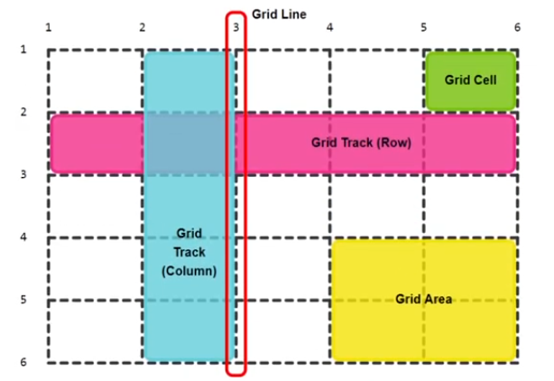

# Curso de Grid

Grid CSS es un sistema de maquetación bidimensional (filas y columnas).

Pensado para planificar las estructuras y seccion de la interfas pricipales de las sitios y aplicacion web.

## Resumen

> -   `display: grid;`
> -   `display: inline-grid;`
> -   `grid-template-columns`
> -   `grid-template-rows`
> -   `grid-template-areas`
> -   `grid-area`
> -   `grid-column`
> -   `grid-row`
> -   `grid-auto-flow`
> -   `grid-auto-rows`
> -   `grid-auto-columns`
> -   `order`
> -   `justify-items`
> -   `align-items`
> -   `justify-self`
> -   `align-self`
> -   `justify-content`
> -   `align-content`
> -   `gap`
> -   `row-gap`
> -   `column-gap`

> -   `1fr`
> -   `auto`
> -   `span`
> -   `repeat()`
> -   `dense`
> -   `minmax()`
> -   `min-content`
> -   `max-content`
> -   `auto-fill`
> -   `auto-fit`
> -   `subgrid`

## Conceptos Basicos

-   Contenedor Padre (Grid Container)
-   Elementos Hijos (Grid Items)
-   Lineas de Cuadricula (Grid Lines)
-   Pista de Cuadricula (Grid Track)
-   Celda de Cuadricula (Grid Cell)
-   Area de Cuadricula (Grid Area)



## Grid Explicita

```HTML
<section class="container grid-explicit">
    <article class="item">
        <p>Grid Item 1</p>
    </article>
    <article class="item">
        <p>Grid Item 2</p>
    </article>
    <article class="item">
        <p>Grid Item 3</p>
    </article>
        ⫶
    <article class="item">
        <p>Grid Item 17</p>
    </article>
    <article class="item">
        <p>Grid Item 18</p>
    </article>
    <article class="item">
        <p>Grid Item 19</p>
    </article>
</section>
```

```CSS
.container {
    margin: 0 auto;
    width: 80%;
    height: 80vh;
    background-color: #222;
    border: medium solid #000;
}

.item {
    padding: 1rem;
    font-size: 1.25rem;
    background-color: #666;
    border: medium solid #999;
}
```

```CSS
/*! GRID EXPLICIT */

.grid-explicit {
    display: grid;

    /* GRID TEMPLATE COLUMN */
    /* grid-template-columns: [tamaños de cada columna] ; */

    /* GRID TEMPLATE ROWS */
    /* grid-template-rows: [tamaños de cada fila] ; */

    /* - 1fr: Es el espacio sobrante */
    /* - repeat(n° de repeticiones, tamanio) */
    /* La funcion repeat solo se puede usar en
       grid-template-columns y grid-template-rows */

    /* Grid de 3cx3r */
    grid-template-columns: 50% 100px 1fr;
    grid-template-rows: 2rem 20vh 30%;

    /* Grid de 5cx4r */
    grid-template-columns: repeat(5, 20%);
    grid-template-rows: repeat(4, auto);
    grid-template-rows: repeat(4, 25%);

    grid-template-columns: repeat(5, 1fr);
    grid-template-rows: repeat(4, 1fr);

    /* Grid 4cx5r */
    grid-template-columns: 20% 30% 30% 20%;
    grid-template-columns: 20% repeat(2, 30%) 20%;
    grid-template-rows: repeat(5, auto);

    /* GRID GAP */
    /* Espacioado entre filas y columnas */
    /* grid-gap, grid-row-gap y grid-column-gap (Obsoletas) */
    grid-row-gap: 1rem;
    grid-column-gap: 2rem;
    /* grid-gap: 100px 0; [row column] */
    row-gap: 2rem;
    column-gap: 4rem;
    /* gap: [row column]; */
    gap: 1vw 1vw;
    gap: 0;
}
```

### Posicionamiento con Grid Lines grid-row grid-column grid-area

```CSS
.grid-explicit {
    display: grid;

    grid-template-columns: 20% repeat(2, 30%) 20%;
    grid-template-rows: repeat(5, auto);
}

.grid-explicit .item:nth-child(10) {
    color: cyan;

    /* GRID ROW - GRID COLUMN - GRID AREA  */

    /* GRID ROW */
    /* grid-row-start y grid-row-end
       - Define la posicion del item respecto de las lineas de fila  */

    /* GRID COLUMN */
    /* grid-column-start y grid-column-end
       - Define la posicion del item respecto de las lineas de columna */

    grid-row-start: 2;
    grid-row-end: 3;

    grid-column-start: 2;
    grid-column-end: 3;

    /* shorthand - grid-row: start / end; */
    grid-row: 2 / 3;

    grid-column: 3 / 4;
    grid-column: 3 / 5;

    /* GRID AREA */
    /* grid-area: grid-row-start / grid-row-end / grid-column-start / grid-column-end */
    /* grid-area: [grid-row] / [grid-column] */
    grid-area: 2 / 3 / 3 / 5;
}

.grid-explicit .item:nth-child(12) {
    color: aqua;

    /* grid-column: 1 / 3; */
    /* grid-area: 1 / 2 / 1 / 4; */
    grid-row: span 2;
    grid-column: span 3;
}

.grid-explicit .item:nth-child(15) {
    color: cyan;

    grid-row: 1 / span 2;
    grid-column: 1 / span 2;
}
```

## Grid con Nombres de Linea

```HTML
<section class="container grid-line-names">
    <article class="item">
        <p>Grid Item 1</p>
    </article>
    <article class="item">
        <p>Grid Item 2</p>
    </article>
    <article class="item">
        <p>Grid Item 3</p>
    </article>
    <article class="item">
        <p>Grid Item 4</p>
    </article>
    <article class="item">
        <p>Grid Item 5</p>
    </article>
    <article class="item">
        <p>Grid Item 6</p>
    </article>
    <article class="item">
        <p>Grid Item 7</p>
    </article>
    <article class="item">
        <p>Grid Item 8</p>
    </article>
    <article class="item">
        <p>Grid Item 9</p>
    </article>
</section>
```

```CSS
.grid-line-names {
    display: grid;

    /* Grid 3cx3r */
    grid-template-columns: repeat(3, 1fr);
    grid-template-rows: repeat(3, 1fr);

    grid-template-columns: [line-c1] 1fr [line-c2] 1fr [line-c3] 1fr [line-c4];
    grid-template-rows:
        [line-r1]
        auto
        [line-r2]
        auto
        [line-r3]
        auto
        [line-r4];
}

.grid-line-names .item:nth-child(3) {
    color: cyan;

    grid-row: line-r3 / line-r4;
    grid-column: line-c1 / line-c4;
    /* grid-area: line-r3 / line-r4 / line-c1 / line-c4; (no funciona)*/
}
```

## Grid con Áreas

```HTML
<section class="container grid-areas">
    <header class="item header">
        <p>Header</p>
    </header>
    <article class="item content">
        <p>Content</p>
    </article>
    <aside class="item sidebar">
        <p>Sidebar</p>
    </aside>
    <footer class="item footer">
        <p>Footer</p>
    </footer>
</section>
```

```CSS
.grid-areas {
    display: grid;

    /* Grid 2cx3r */
    grid-template-columns: 1fr 200px;
    /* grid-template-rows: 100px 1fr 60px; */
    grid-template-rows: 100px repeat(2, 1fr) 60px;

    /* GRID TEMPLATE AREAS */
    /* "." significa celda vacia */
    grid-template-areas:
        "header  header"
        "content sidebar"
        "content ."
        "footer  footer";
}

.header {
    grid-area: header;
}

.content {
    grid-area: content;
}

.sidebar {
    grid-area: sidebar;
}

.footer {
    grid-area: footer;
}
```

## Grid Implícita

Cuando los elementos items sales de la cuadricula explicita definida (4 columnas y 3 filas), se acomodan con diferentes alturas

```HTML
<section class="container grid-implicit">
    <article class="item">
        <p>Grid Item 1</p>
    </article>
    <article class="item">
        <p>Grid Item 2</p>
    </article>
    <article class="item">
        <p>Grid Item 3</p>
    </article>
        ⫶
    <article class="item">
        <p>Grid Item 17</p>
    </article>
    <article class="item">
        <p>Grid Item 18</p>
    </article>
    <article class="item">
        <p>Grid Item 19</p>
    </article>
</section>
<span>🔝</span>
```

```CSS
.grid-implicit {
    /* INLINE-GRID - ELEMENTO EN LINEA */
    display: inline-grid;
    /* GRID - ELEMENTO CON COMPORTAMIENTO EN BLOQUE */
    display: grid;

    /* Grid 4cx3r */
    grid-template-columns: repeat(4, 1fr);
    grid-template-rows: repeat(3, 200px);
}
```

## Flujo de la Grid Grid Flow

El flujo de la disposicion de los items.

```HTML
<section class="container grid-flow">
    <article class="item">
        <p>Grid Item 1</p>
    </article>
    <article class="item">
        <p>Grid Item 2</p>
    </article>
    <article class="item">
        <p>Grid Item 3</p>
    </article>
        ⫶
    <article class="item">
        <p>Grid Item 17</p>
    </article>
    <article class="item">
        <p>Grid Item 18</p>
    </article>
    <article class="item">
        <p>Grid Item 19</p>
    </article>
</section>
```

```CSS
.grid-flow {
    display: grid;

    /* Grid 5cx3r */
    grid-template-columns: repeat(5, 1fr);
    grid-template-rows: repeat(3, 150px);

    /* GRID-AUTO-FLOW - row | column */
    /* El flujo de los elementos items pueden
       ser de row(fila) o column(columna) */
    grid-auto-flow: row; /* default */
    grid-auto-flow: column;

    /* GRID-AUTO-ROWS */
    /* Determina un tamaño especifico de los
       filas que se generen implicitamente
       por el flujo de la grid */
    grid-auto-rows: auto;
    grid-auto-rows: 100px;

    /* GRID-AUTO-COLUMNS */
    /* Determina un tamaño especifico de los columnas
       que se generen implicitamente por el flujo
       de la grid */
    grid-auto-columns: 50px;
}
```

## Flujo Denso de la Grid - Grid Flow Dense

```HTML
<section class="container grid-flow-dense">
    <article class="item">
        <p>Grid Item 1</p>
    </article>
    <article class="item">
        <p>Grid Item 2</p>
    </article>
    <article class="item">
        <p>Grid Item 3</p>
    </article>
        ⫶
    <article class="item">
        <p>Grid Item 17</p>
    </article>
    <article class="item">
        <p>Grid Item 18</p>
    </article>
    <article class="item">
        <p>Grid Item 19</p>
    </article>
</section>
```

```CSS
.grid-flow-dense {
    display: grid;

    /* 5cx4r */
    grid-template-columns: repeat(5, 1fr);
    grid-template-rows: repeat(4, 200px);

    /* dense - las celdas vacias, los elementos
       aprovechan esos espacios vacios */
    grid-auto-flow: row dense;
    grid-auto-flow: column dense;
}

.grid-flow-dense .item:nth-child(9) {
    color: cyan;
    grid-row: span 3;
    grid-column: span 3;
}

.grid-flow-dense .item:nth-child(11) {
    color: cyan;
    grid-row: span 3;
    grid-column: span 3;
}
```

## Celdas en Capas Superposicion - Grid Layers

```HTML
<section class="container grid-layers">
    <article class="item">
        <p>Grid Item 1</p>
    </article>
    <article class="item">
        <p>Grid Item 2</p>
    </article>
    <article class="item">
        <p>Grid Item 3</p>
    </article>
    <article class="item">
        <p>Grid Item 4</p>
    </article>
    <article class="item">
        <p>Grid Item 5</p>
    </article>
</section>
```

```CSS
.grid-layers {
    display: grid;

    /* 4cx4r */
    grid-template-columns:repeat(4,1fr);
    grid-template-rows: repeat(4, 1fr);
}

.grid-layers .item:nth-child(1) {
    background-color: yellow;

    grid-column: 1 / 3;
    grid-row: 1 / 3;
}
.grid-layers .item:nth-child(2) {
    background-color: blue;

    grid-column: 3 / 5;
    grid-row: 1 / 3;
}
.grid-layers .item:nth-child(3) {
    background-color: palegreen;
    grid-column: 1 / 3;
    grid-row: 3 / 5;
}
.grid-layers .item:nth-child(4) {
    background-color: orange;

    grid-column: 3 / 5;
    grid-row: 3 / 5;
}
.grid-layers .item:nth-child(5) {
    background-color: #c92af0;

    grid-column: 2 / 4;
    grid-row: 2 / 4;
}
```

## Ordenamiento y Alineación de Grid Items

### Ordenamiento de los Grid Items

```HTML
<section class="container grid-order">
    <article class="item">
        <p>Grid Item 1</p>
    </article>
    <article class="item">
        <p>Grid Item 2</p>
    </article>
    <article class="item">
        <p>Grid Item 3</p>
    </article>
    <article class="item">
        <p>Grid Item 4</p>
    </article>
    <article class="item">
        <p>Grid Item 5</p>
    </article>
</section>
```

```CSS
.grid-order {
    display: grid;

    /* 3cx2r */
    grid-template-columns:repeat(3,1fr);
    grid-template-rows: repeat(2, 1fr);

    grid-auto-flow: column;
}

.grid-order .item:nth-child(1) {

    /* ORDER */
    /* Con valor menor del orden del item siempre irá
       antes que un item con valor de orden mayor */
    /* default es 0, valores negativos y positivos */
    order: 0;
    order: 1;
}

.grid-order .item:nth-child(2) {
    order: 2;
}
.grid-order .item:nth-child(5) {
    order: -1;
}
```

### Alineamiento de Grid Items

```HTML
<section class="container grid-align">
    <article class="item">
        <p>Grid Item 1</p>
    </article>
    <article class="item">
        <p>Grid Item 2</p>
    </article>
    <article class="item">
        <p>Grid Item 3</p>
    </article>
    <article class="item">
        <p>Grid Item 4</p>
    </article>
    <article class="item">
        <p>Grid Item 5</p>
    </article>
</section>
```

```CSS
.grid-align {
    display: grid;

    /* 3cx2r */
    grid-template-columns: repeat(3, 200px);
    grid-template-rows: repeat(2, 200px);

    /* JUSTIFY ITEMS */
    /* Los ayudan a alinear los elementos en el eje-X */
    justify-items: stretch; /* se estiran al valor de la grid*/
    justify-items: start;
    justify-items: end;
    justify-items: center;

    /* ALIGN ITEMS */
    /* Los ayudan a alinear los elementos en el eje-Y */
    align-items: stretch;
    align-items: start;
    align-items: end;
    align-items: center;
}

.grid-align .item:nth-child(4) {

    /* JUSTIFY SELF */
    /* Alineamiento de cada elemento item en eje-X */
    justify-self: start;

    /* ALIGN SELF */
    /* Alineamiento de cada elemento item en eje-Y */
    align-self: start;
}
```

### Alineación de Grid Tracks

```HTML
<section class="container grid-align-tracks">
    <article class="item">
        <p>Grid Item 1</p>
    </article>
    <article class="item">
        <p>Grid Item 2</p>
    </article>
    <article class="item">
        <p>Grid Item 3</p>
    </article>
    <article class="item">
        <p>Grid Item 4</p>
    </article>
    <article class="item">
        <p>Grid Item 5</p>
    </article>
</section>
```

```CSS
.grid-align-tracks {
    display: grid;

    /* 3cx2r */
    grid-template-columns: repeat(3, 200px);
    grid-template-rows: repeat(2, 200px);

    /* JUSTIFY CONTENT */
    /* Alinea los grid tracks en el eje-X (horizontal) */
    justify-content: start; /* default */
    justify-content: end;
    justify-content: center;
    justify-content: space-between;
    justify-content: space-around;
    justify-content: space-evenly;

    /* ALIGN CONTENT */
    /* Alinea los grid tracks en el eje-Y (vertical) */
    align-content: start; /* default */
    align-content: end;
    align-content: center;
    align-content: space-between;
    align-content: space-around;
    align-content: space-evenly;
}
```

## Tamaños Máximos Y Mínimos de Grid Tracks

Con Grid se introdujo la funcion `minmax()` y los
valores `min-content` `max-content`

```HTML
<section class="container grid-min-max">
    <article class="item">
        <p>GridItem1</p>
        <p>Lorem ipsum dolor sit, amet consectetur
           adipisicing elit. Saepe, sit ab. Facilis
           laboriosam consequatur expedita cum,
           exercitationem ab odio voluptates.</p>
    </article>
    <article class="item">
        <p>Grid Item 2</p>
    </article>
    <article class="item">
        <p>Grid Item 3</p>
    </article>
    <article class="item">
        <p>Grid Item 4</p>
    </article>
    <article class="item">
        <p>Grid Item 5</p>
    </article>
</section>
```

```CSS
.grid-min-max {
    display: grid;

    /* Grid 4cx?r */
    /* minmax() se aligna los valores minimos y maximos */
    /* min-content - El tamaño sera hasta el minimo contenido   */
    grid-template-columns: repeat(4, 1fr);
    grid-template-columns: repeat(4, minmax(100px, 200px));
    grid-template-columns: repeat(4, minmax(min-content, 200px));
    grid-template-columns: repeat(4, minmax(100px, min-content));
    grid-template-columns: repeat(4, minmax(100px, max-content));
    grid-template-columns: repeat(4, minmax(max-content, 200px));
    grid-template-columns: repeat(4, minmax(min-content, max-content));
}
```

## Grids con Patrones Repetitivos

```HTML
<section class="container grid-repeat">
    <article class="item">
        <p>Grid Item 1</p>
    </article>
    <article class="item">
        <p>Grid Item 2</p>
    </article>
    <article class="item">
        <p>Grid Item 3</p>
    </article>
        ⫶
    <article class="item">
        <p>Grid Item 17</p>
    </article>
    <article class="item">
        <p>Grid Item 18</p>
    </article>
    <article class="item">
        <p>Grid Item 19</p>
    </article>
</section>
```

```CSS
.grid-repeat {
    display: grid;

    /* Grid 4cx4r */
    /* La funcion repeat solo se puede usar en
       grid-template-columns y grid-template-rows */
    grid-template-columns: repeat(4, 10% 20% 30% 40%);
    grid-template-columns: repeat(3, 10% 20% 30% 40%);
    grid-template-columns: repeat(2, 10% 20% 30% 40%);
    grid-template-columns: repeat(1, 10% 20% 30% 40%);

    grid-template-rows: repeat(2, 10vh 20vh);
    grid-template-rows: repeat(2, 100px 200px);

    /* grid-auto-flow: row; */
    grid-auto-rows: 150px;
    grid-auto-rows: repeat(2, 100px 200px); /* ❌ */
}
```

## Grids Dinámicas

```HTML
<section class="container grid-dynamics">
    <article class="item">
        <p>Grid Item 1</p>
    </article>
    <article class="item">
        <p>Grid Item 2</p>
    </article>
    <article class="item">
        <p>Grid Item 3</p>
    </article>
    <article class="item">
        <p>Grid Item 4</p>
    </article>
    <article class="item">
        <p>Grid Item 5</p>
    </article>
</section>
```

```CSS
.grid-dynamics {
    display: grid;

    /* Grid 4cx?r */
    /* AUTO FILL - Rellena la grid con tracks generados dinamicamente */
    /* AUTO FIT - Ajusta la grid con los tracks existentes */
    grid-template-columns: repeat(4, 100px);
    grid-template-columns: repeat(auto-fill, 100px);
    grid-template-columns: repeat(auto-fit, 100px);

    grid-template-columns: repeat(auto-fill, minmax(100px, 1fr));
    grid-template-columns: repeat(auto-fit, minmax(100px, 1fr));
}
```

## Responsive sin Media Queries

```HTML
<section class="container grid-responsive">
    <article class="item">
        <p>Grid Item 1</p>
    </article>
    <article class="item">
        <p>Grid Item 2</p>
    </article>
    <article class="item">
        <p>Grid Item 3</p>
    </article>
        ⫶
    <article class="item">
        <p>Grid Item 17</p>
    </article>
    <article class="item">
        <p>Grid Item 18</p>
    </article>
    <article class="item">
        <p>Grid Item 19</p>
    </article>
</section>
```

```CSS
.grid-responsive {
    display: grid;
    grid-template-columns: repeat(auto-fit, minmax(200px, 1fr));
    gap: 1vw;
}
```

## Grid Anidadas

```HTML
<section class="container grid-nested">

    <article class="item grid-nested">
        <div class="sub-item">
            <p>Grid Subitem Anidados 1</p>
        </div>
        <div class="sub-item">
            <p>Grid Subitem Anidados 2</p>
        </div>
        <div class="sub-item">
            <p>Grid Subitem Anidados 3</p>
        </div>
        <div class="sub-item">
            <p>Grid Subitem Anidados 4</p>
        </div>
        <div class="sub-item">
            <p>Grid Subitem Anidados 5</p>
        </div>
    </article>

    <article class="item">
        <p>Grid Item 2</p>
    </article>

    <article class="item">
        <p>Grid Item 3</p>
    </article>

    <article class="item">
        <p>Grid Item 4</p>
    </article>

    <article class="item">
        <p>Grid Item 5</p>
    </article>

</section>
```

```CSS
.grid-nested {
    display: grid;

    /* Grid 3cx?r */
    grid-template-columns: repeat(3, 1fr);
}

.sub-item {
    background-color: #ddd;
    padding: 1rem;
    border: medium solid #ccc;
}
```

## SubGrids

_Consideraciones:_

-   Contenedor Abuelo: Es el contenedor general (contenedor de los grids)
-   Contenedor Padre: El es contenedor de los subgrids
-   Subgrids: Son los elementos hijos del contenedor padre

Para que la característica de subgrid funcione es necesario
hacer los siguientes pasos:

1. Definir explícitamente el tamaño que ocupará el elemento que aplicará
   subgrid dentro del contenedor padre grid, es decir definir sus propiedades grid-column y grid-row al contenedor padre de los subgrids.

2. Aplicar display grid al elemento que aplicará subgrid (Contenedor padre).

3. Aplicar el valor de subgrid a las columnas, a las filas o ambas depende de cómo se requiera.

```HTML
<section class="container grid">
    <article class="item subgrid">
        <div class="sub-item">
            <p>Grid Subitem 1</p>
        </div>
        <div class="sub-item">
            <p>Grid Subitem 2</p>
        </div>
        <div class="sub-item">
            <p>Grid Subitem 3</p>
        </div>
        <div class="sub-item">
            <p>Grid Subitem 4</p>
        </div>
        <div class="sub-item">
            <p>Grid Subitem 5</p>
        </div>
    </article>
    <article class="item">
        <p>Grid Item 2</p>
    </article>
    <article class="item">
        <p>Grid Item 3</p>
    </article>
    <article class="item">
        <p>Grid Item 4</p>
    </article>
    <article class="item">
        <p>Grid Item 5</p>
    </article>
</section>
```

```CSS
.grid {
    display: grid;

    /* Grid de 3cx4r */
    grid-template-columns: repeat(3, 1fr);
    grid-template-rows: repeat(4, 1fr);
}

.subgrid {
    /* Para que la característica de subgrid funcione es necesario
       hacer los siguientes pasos:

       1) Definir explícitamente el tamaño que ocupará el elemento
          que aplicará subgrid dentro del contenedor padre grid,
          es decir, definir sus propiedades grid-column y grid-row al
          contenedor padre de los subgrid.

       2) Aplicar display grid al elemento que aplicará subgrid.

       3) Aplicar el valor de subgrid a las columnas,
          a las filas o ambas depende de cómo se requiera.
    */

    /* Paso 1 */
    grid-column: span 3;
    grid-row: 1 / 3;

    /* Paso 2 */
    display: grid;

    /* Paso 3 */
    grid-template-columns: subgrid;
    grid-template-rows: subgrid;
}
```
